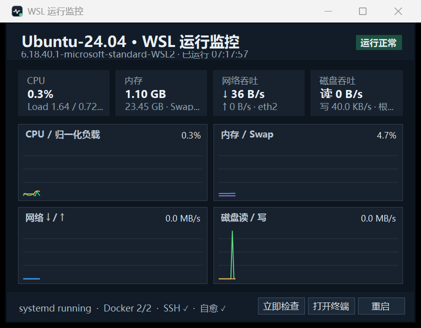

# WSL KeepAlive Tray

一个轻量、无控制台窗口的 Windows 托盘应用，用于保持 WSL 运行并实时查看 CPU、负载、内存、磁盘和网络吞吐。

它用一条隐藏且持续的 `wsl.exe` 遥测连接完成保活，不再依赖每隔几分钟启动一次 CMD/PowerShell 的计划任务，因此不会周期性抢走输入焦点。WSL 内部的服务自愈交给 systemd timer。

> A lightweight Windows tray app that keeps one WSL distro alive without console pop-ups, shows live resource telemetry, and delegates service recovery to systemd.



## 功能

- Windows 登录后自动启动指定 WSL 发行版，并保持一条隐藏遥测连接。
- 托盘悬停显示 WSL 状态、CPU、内存和网络吞吐。
- 右键菜单显示 CPU、1/5/15 分钟负载、内存、Swap、根盘、磁盘吞吐、网络吞吐、Docker、SSH 和 watchdog 状态。
- 双击打开实时监控面板，查看最近约四分钟的趋势。
- 支持立即健康检查、打开终端、启动、重启和停止 WSL。
- systemd timer 每五分钟检查可配置的服务和 Docker 容器。
- 使用 Windows GUI 子系统并重定向所有标准句柄，不创建 CMD 或 PowerShell 窗口。

## 系统要求

- Windows 11 与 WSL 2。
- 目标发行版已启用 systemd。
- WSL 内有 Python 3。
- .NET Framework 4.8 运行时；Windows 11 默认包含。
- Docker 和 OpenSSH Server 为可选项；未安装时托盘会显示相应服务未启用。

## 快速安装

```powershell
git clone https://github.com/CherishLJ/wsl-keepalive-tray.git
cd wsl-keepalive-tray
.\scripts\install.ps1
```

默认发行版为 `Ubuntu-24.04`。使用其他发行版时传入 `wsl.exe -l -q` 中显示的准确名称：

```powershell
.\scripts\install.ps1 -Distro Debian
```

当前版本允许发行版名使用字母、数字、点、横线、下划线和加号；这是为了避免 `wsl.exe` 在 .NET Framework 下把引号误当成名称内容。

安装位置默认为 `%LOCALAPPDATA%\Programs\WSLKeepAliveTray`。安装器会构建程序、安装 Linux 遥测 agent 与 systemd timer、注册当前用户登录自启，并在全部验证通过后禁用同名旧计划任务（如果存在）。

## Watchdog 配置

配置文件位于 WSL 内：

```text
/etc/default/wsl-keepalive-tray
```

默认配置：

```sh
WATCHDOG_SERVICES="docker.service ssh.service"
WATCHDOG_CONTAINERS=""
```

可以填写需要自动拉起的容器名，以空格分隔。已有 Docker restart policy 的容器通常无需填写。修改后可立即验证：

```bash
sudo systemctl start wsl-tray-watchdog.service
sudo systemctl status wsl-tray-watchdog.service
```

## 托盘状态

- 绿色：WSL、Docker、SSH、watchdog 和容器均正常。
- 黄色：WSL 正在运行，但一个或多个受监控服务需要关注。
- 蓝色：正在启动或恢复遥测连接。
- 灰色：用户主动停止 WSL。
- 红色：无法启动或发生错误。

## 构建与测试

```powershell
.\scripts\build.ps1
```

构建脚本使用 Windows 自带的 .NET Framework C# 编译器，不需要安装 .NET SDK 或第三方 NuGet 包。输出位于 `build\`，并自动执行内置自测。

完整恢复测试会短暂终止目标 WSL：

```powershell
.\scripts\test-recovery.ps1 -Distro Ubuntu-24.04
```

## 卸载与回滚

```powershell
.\scripts\uninstall.ps1
```

卸载器会退出托盘、删除本项目安装的 agent 和 systemd 单元、移除登录自启，并在旧计划任务首次安装前处于启用状态时重新启用它。watchdog 配置文件会保留，便于重新安装。

## 工作原理

```text
Windows tray process
  └─ hidden wsl.exe session (keepalive + JSON telemetry every 2 s)
       └─ Python agent reads /proc and queries systemd/Docker

systemd timer (inside WSL, every 5 min)
  └─ watchdog checks configured services and optional containers
```

应用只读取本机资源与服务状态，不包含联网遥测、账号系统或远程数据上传。当前版本一次运行监控一个 WSL 发行版。

## License

[MIT](LICENSE)
